# DM_ch2
ksg  
2015년 8월 17일  

###데이터 import

```r
ex<- read.csv("http://goo.gl/qw303p")
head(ex)
```

```
##        age gender   income kids ownHome subscribe    Segment
## 1 47.31613   Male 49482.81    2   ownNo     subNo Suburb mix
## 2 31.38684   Male 35546.29    1  ownYes     subNo Suburb mix
## 3 43.20034   Male 44169.19    0  ownYes     subNo Suburb mix
## 4 37.31700 Female 81041.99    1   ownNo     subNo Suburb mix
## 5 40.95439 Female 79353.01    3  ownYes     subNo Suburb mix
## 6 43.03387   Male 58143.36    4  ownYes     subNo Suburb mix
```

```r
str(ex)
```

```
## 'data.frame':	300 obs. of  7 variables:
##  $ age      : num  47.3 31.4 43.2 37.3 41 ...
##  $ gender   : Factor w/ 2 levels "Female","Male": 2 2 2 1 1 2 2 2 1 1 ...
##  $ income   : num  49483 35546 44169 81042 79353 ...
##  $ kids     : int  2 1 0 1 3 4 3 0 1 0 ...
##  $ ownHome  : Factor w/ 2 levels "ownNo","ownYes": 1 2 2 1 2 2 1 1 1 2 ...
##  $ subscribe: Factor w/ 2 levels "subNo","subYes": 1 1 1 1 1 1 1 1 1 1 ...
##  $ Segment  : Factor w/ 4 levels "Moving up","Suburb mix",..: 2 2 2 2 2 2 2 2 2 2 ...
```

###막대그림

```r
A<-table(ex$Segment)
barplot(A)
```

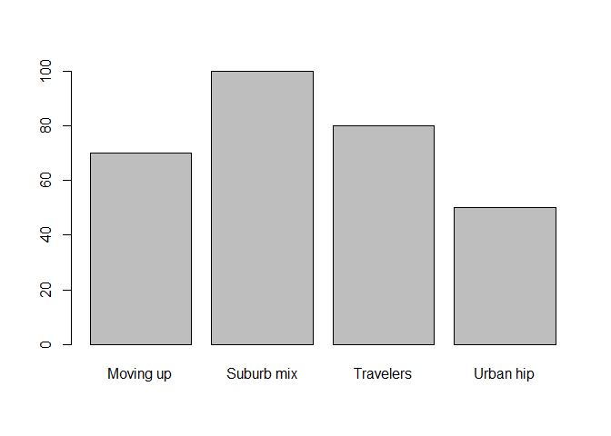 

###원그림

```r
pie(A)
```

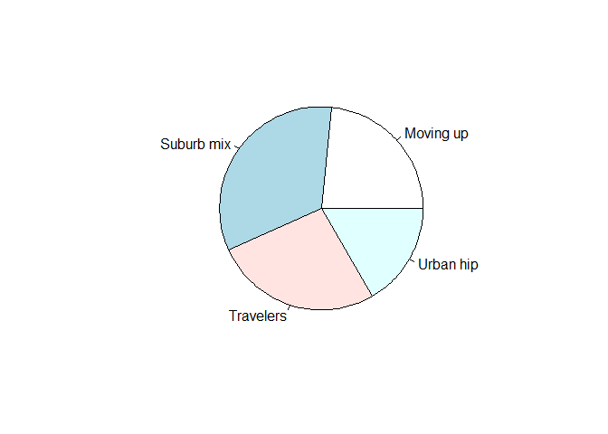 

###히스토그램(도수분포표)

```r
hist(ex$age)
```

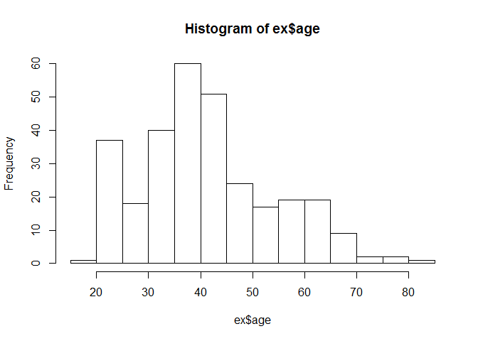 

###산점도

```r
plot(ex$income, ex$age)
```

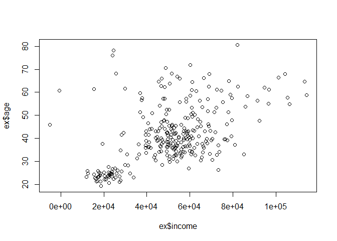 


###산점도 행렬

```r
head(iris)
```

```
##   Sepal.Length Sepal.Width Petal.Length Petal.Width Species
## 1          5.1         3.5          1.4         0.2  setosa
## 2          4.9         3.0          1.4         0.2  setosa
## 3          4.7         3.2          1.3         0.2  setosa
## 4          4.6         3.1          1.5         0.2  setosa
## 5          5.0         3.6          1.4         0.2  setosa
## 6          5.4         3.9          1.7         0.4  setosa
```

```r
pairs(iris[1:4])
```

 

###모자이크 그림

```r
mo<-with(ex, table(Segment, ownHome))
mosaicplot(mo)
```

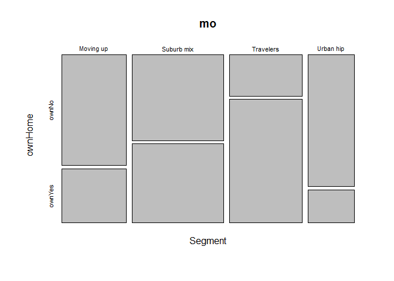 

###시계열 그림

```r
ts.data<-rnorm(52,10,4)
ts<-ts(ts.data, start=2015, fre=52)
plot(ts)
```

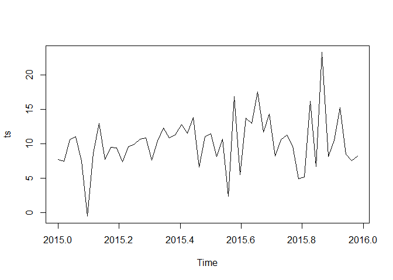 


###연습문제1 

  - 데이터 생성

```r
life<-sample(c(1,2,3), size=25, replace=TRUE,prob=NULL)
school<-sample(c(1,2,3), size=25, replace=TRUE,prob=NULL)
ex1<-data.frame(life,school)
ex1
```

```
##    life school
## 1     3      3
## 2     1      2
## 3     2      2
## 4     2      3
## 5     3      2
## 6     3      1
## 7     3      2
## 8     2      1
## 9     3      3
## 10    2      3
## 11    2      1
## 12    2      1
## 13    2      2
## 14    1      3
## 15    3      1
## 16    3      2
## 17    3      2
## 18    3      3
## 19    1      2
## 20    3      3
## 21    1      2
## 22    1      1
## 23    1      3
## 24    2      2
## 25    3      2
```

  - 변수의 속성 분류

```r
ex1$life<-factor(ex1$life, labels = c('고소득', '보통','저소득'))
ex1$school<-factor(ex1$school, labels = c('중졸이하', '고졸','대졸이상'))
ex1
```

```
##      life   school
## 1  저소득 대졸이상
## 2  고소득     고졸
## 3    보통     고졸
## 4    보통 대졸이상
## 5  저소득     고졸
## 6  저소득 중졸이하
## 7  저소득     고졸
## 8    보통 중졸이하
## 9  저소득 대졸이상
## 10   보통 대졸이상
## 11   보통 중졸이하
## 12   보통 중졸이하
## 13   보통     고졸
## 14 고소득 대졸이상
## 15 저소득 중졸이하
## 16 저소득     고졸
## 17 저소득     고졸
## 18 저소득 대졸이상
## 19 고소득     고졸
## 20 저소득 대졸이상
## 21 고소득     고졸
## 22 고소득 중졸이하
## 23 고소득 대졸이상
## 24   보통     고졸
## 25 저소득     고졸
```

  - 막대그래프 원그래프

```r
par(mfrow=c(2,2))
bar_life<-table(ex1$life)
barplot(bar_life)
pie(bar_life)

bar_sch<-table(ex1$school)
barplot(bar_sch)
pie(bar_sch)
```

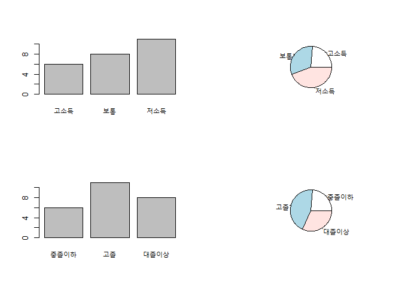 

```r
par(mfrow=c(1,1))
```

  - 교차표 생성

```r
table(ex1$life, ex1$school)
```

```
##         
##          중졸이하 고졸 대졸이상
##   고소득        1    3        2
##   보통          3    3        2
##   저소득        2    5        4
```

  - 유클리드 제곱 거리(상위10명)

```r
life<-sample(c(1,2,3), size=10, replace=TRUE,prob=NULL)
school<-sample(c(1,2,3), size=10, replace=TRUE,prob=NULL)
ex1<-matrix(life, school, nrow=10, ncol=2)
ex1_U<-dist(ex1)
ex1_U
```

```
##           1        2        3        4        5        6        7        8
## 2  1.414214                                                               
## 3  1.000000 1.000000                                                      
## 4  2.828427 1.414214 2.236068                                             
## 5  2.236068 1.000000 2.000000 1.000000                                    
## 6  0.000000 1.414214 1.000000 2.828427 2.236068                           
## 7  1.414214 0.000000 1.000000 1.414214 1.000000 1.414214                  
## 8  1.000000 1.000000 0.000000 2.236068 2.000000 1.000000 1.000000         
## 9  2.828427 1.414214 2.236068 0.000000 1.000000 2.828427 1.414214 2.236068
## 10 2.236068 1.000000 2.000000 1.000000 0.000000 2.236068 1.000000 2.000000
##           9
## 2          
## 3          
## 4          
## 5          
## 6          
## 7          
## 8          
## 9          
## 10 1.000000
```

### 연습문제 2 

  - 데이터생성

```r
a<-round(rnorm(31,28,4))
```


  - 히스토그램, 박스플랏

```r
hist(a)
```

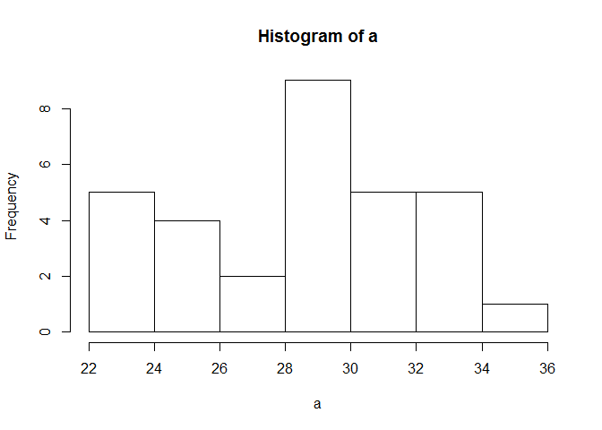 

```r
boxplot(a)
```

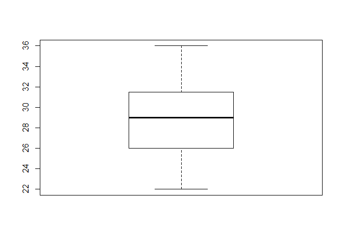 

  - 통계량

```r
library(psych)
```

```
## Warning: package 'psych' was built under R version 3.2.2
```

```r
describe(a)
```

```
##   vars  n mean  sd median trimmed  mad min max range  skew kurtosis   se
## 1    1 31 28.9 3.8     29   28.96 4.45  22  36    14 -0.19    -0.99 0.68
```

###연습문제 4 
  - 데이터 생성

```r
sex<-sample(c("남","여"), size=10, replace=TRUE,prob=NULL)
X<-round(rnorm(10, 65,4))
Y<-round(rnorm(10, 6,3))
Z<-data.frame(sex,X,Y)
```

 - 산점도, 통계량

```r
plot(Z$X,Z$Y)
```

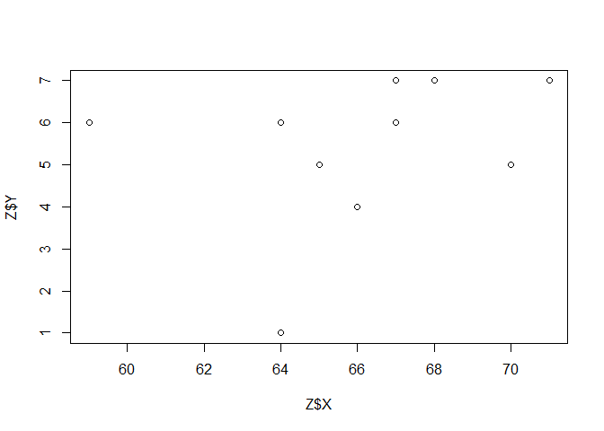 

```r
mean(X); sd(X)
```

```
## [1] 66.1
```

```
## [1] 3.414023
```

```r
mean(Y); sd(Y)
```

```
## [1] 5.4
```

```
## [1] 1.837873
```

 - 유클리드 제곱거리

```r
taja<-matrix(X,Y, nrow=10, ncol=2)
taja_dist<-dist(taja)
taja_dist
```

```
##            1         2         3         4         5         6         7
## 2  12.649111                                                            
## 3   7.280110  5.385165                                                  
## 4   4.472136 10.000000  5.000000                                        
## 5   5.000000  8.062258  3.162278  5.000000                              
## 6   0.000000 12.649111  7.280110  4.472136  5.000000                    
## 7  12.649111  0.000000  5.385165 10.000000  8.062258 12.649111          
## 8   7.280110  5.385165  0.000000  5.000000  3.162278  7.280110  5.385165
## 9   4.472136 10.000000  5.000000  0.000000  5.000000  4.472136 10.000000
## 10  5.000000  8.062258  3.162278  5.000000  0.000000  5.000000  8.062258
##            8         9
## 2                     
## 3                     
## 4                     
## 5                     
## 6                     
## 7                     
## 8                     
## 9   5.000000          
## 10  3.162278  5.000000
```

###연습문제 5 

  - 데이터생성

```r
rev1<-c(210,235,280,350,355,360,450,560,600,620)
rev2<-c(10,11,25,20,18,20,30,40,45,40)
```

  - 데이터생성

```r
rev<-ts(rev1, start=1985, end=1994, freq=1)
rev_2<-ts(rev2, start=1985, end=1994, freq=1)
```

  - 시계열 선그래프

```r
plot(rev)
```

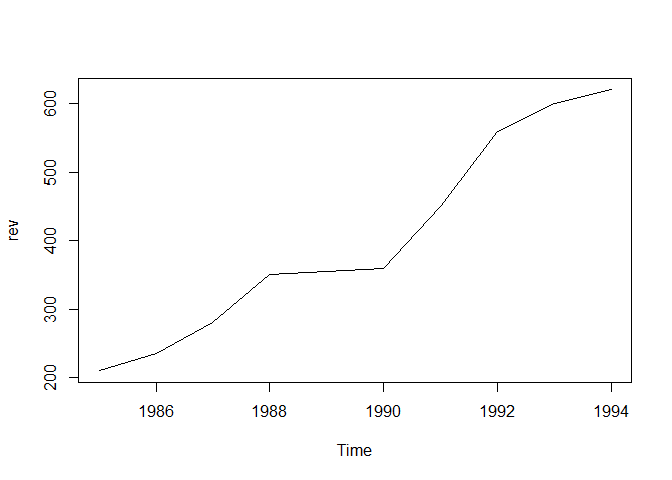 

```r
plot(rev_2)
```

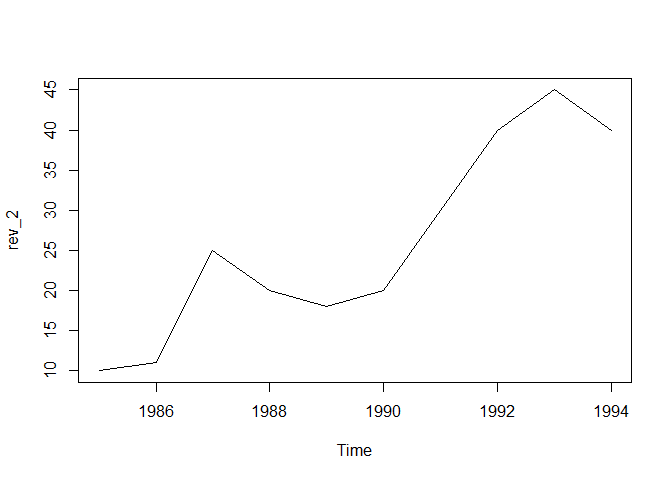 


### 연습문제 7 
  - 데이터 생성

```r
age<-round(rnorm(10,30,15))
buy<-rbinom(10,1,0.5)
data<-data.frame(age, buy)
data$buy <- factor(data$buy, labels=c("Y","N"))
data
```

```
##    age buy
## 1   35   Y
## 2   34   Y
## 3   12   N
## 4   37   N
## 5   25   N
## 6   41   Y
## 7   19   Y
## 8   27   Y
## 9   35   Y
## 10  26   N
```

  - 나이 별 변수생성

```r
data$age1 <- ifelse(data$age >= 30, "30살이상", "30살미만")
data$age2 <- ifelse(data$age >= 40, "40살이상", "40살미만")
data
```

```
##    age buy     age1     age2
## 1   35   Y 30살이상 40살미만
## 2   34   Y 30살이상 40살미만
## 3   12   N 30살미만 40살미만
## 4   37   N 30살이상 40살미만
## 5   25   N 30살미만 40살미만
## 6   41   Y 30살이상 40살이상
## 7   19   Y 30살미만 40살미만
## 8   27   Y 30살미만 40살미만
## 9   35   Y 30살이상 40살미만
## 10  26   N 30살미만 40살미만
```

  - 테이블 생성

```r
table(data$buy,data$age1)
```

```
##    
##     30살미만 30살이상
##   Y        2        4
##   N        3        1
```

```r
table(data$buy,data$age2)
```

```
##    
##     40살미만 40살이상
##   Y        5        1
##   N        4        0
```


