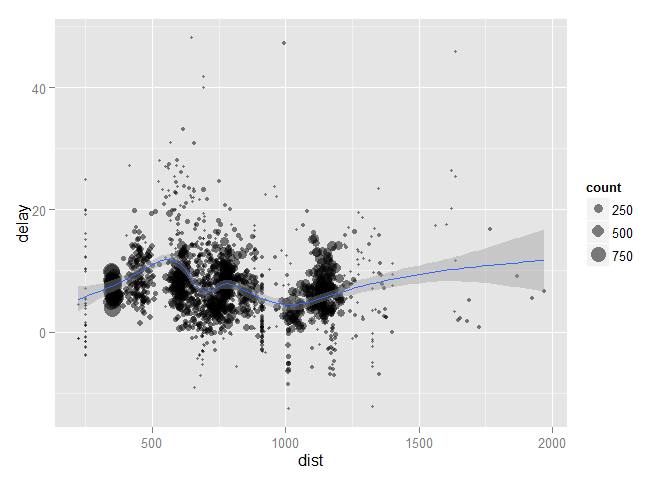
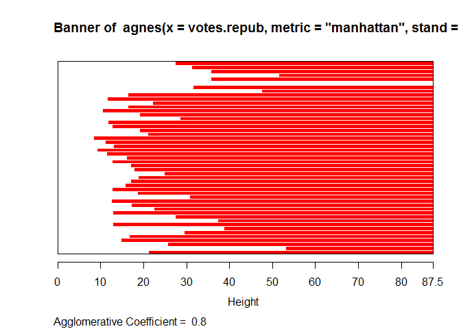
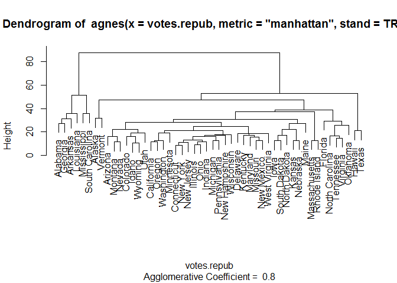
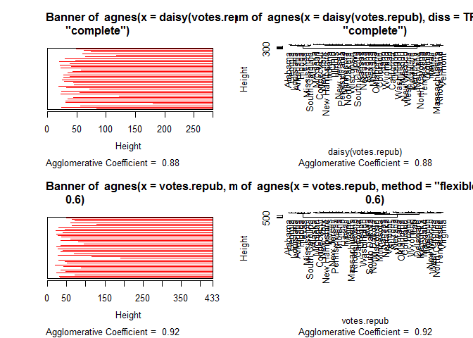

# DMR-2.1
ksg  
2015년 8월 21일  

##1)데이터 전처리
###dplyr 패키지
  - dplyr 패키지는 C++로 작성되어 매우 빠르다
  - MySQL 등을 지원한다
  - 다양한 기능은 스스로 찾아서 학습해라

###dplyr, hflights 설치

```r
#install.packages(c("dplyr", "hflights"))
library(dplyr)
```

```
## Warning: package 'dplyr' was built under R version 3.2.2
```

```
## 
## Attaching package: 'dplyr'
## 
## The following objects are masked from 'package:stats':
## 
##     filter, lag
## 
## The following objects are masked from 'package:base':
## 
##     intersect, setdiff, setequal, union
```

```r
library(hflights)
```

```
## Warning: package 'hflights' was built under R version 3.2.2
```

###데이터 확인

```r
dim(hflights)
```

```
## [1] 227496     21
```

```r
head(hflights)
```

```
##      Year Month DayofMonth DayOfWeek DepTime ArrTime UniqueCarrier
## 5424 2011     1          1         6    1400    1500            AA
## 5425 2011     1          2         7    1401    1501            AA
## 5426 2011     1          3         1    1352    1502            AA
## 5427 2011     1          4         2    1403    1513            AA
## 5428 2011     1          5         3    1405    1507            AA
## 5429 2011     1          6         4    1359    1503            AA
##      FlightNum TailNum ActualElapsedTime AirTime ArrDelay DepDelay Origin
## 5424       428  N576AA                60      40      -10        0    IAH
## 5425       428  N557AA                60      45       -9        1    IAH
## 5426       428  N541AA                70      48       -8       -8    IAH
## 5427       428  N403AA                70      39        3        3    IAH
## 5428       428  N492AA                62      44       -3        5    IAH
## 5429       428  N262AA                64      45       -7       -1    IAH
##      Dest Distance TaxiIn TaxiOut Cancelled CancellationCode Diverted
## 5424  DFW      224      7      13         0                         0
## 5425  DFW      224      6       9         0                         0
## 5426  DFW      224      5      17         0                         0
## 5427  DFW      224      9      22         0                         0
## 5428  DFW      224      9       9         0                         0
## 5429  DFW      224      6      13         0                         0
```

```r
hflights_df<-tbl_df(hflights) #화면에 맞게 일부만 보여줌
hflights_df
```

```
## Source: local data frame [227,496 x 21]
## 
##    Year Month DayofMonth DayOfWeek DepTime ArrTime UniqueCarrier FlightNum
## 1  2011     1          1         6    1400    1500            AA       428
## 2  2011     1          2         7    1401    1501            AA       428
## 3  2011     1          3         1    1352    1502            AA       428
## 4  2011     1          4         2    1403    1513            AA       428
## 5  2011     1          5         3    1405    1507            AA       428
## 6  2011     1          6         4    1359    1503            AA       428
## 7  2011     1          7         5    1359    1509            AA       428
## 8  2011     1          8         6    1355    1454            AA       428
## 9  2011     1          9         7    1443    1554            AA       428
## 10 2011     1         10         1    1443    1553            AA       428
## ..  ...   ...        ...       ...     ...     ...           ...       ...
## Variables not shown: TailNum (chr), ActualElapsedTime (int), AirTime
##   (int), ArrDelay (int), DepDelay (int), Origin (chr), Dest (chr),
##   Distance (int), TaxiIn (int), TaxiOut (int), Cancelled (int),
##   CancellationCode (chr), Diverted (int)
```

###dplyr패키지를 활용한 데이터 추출(1월, 1,2월)
 
  - filter함수 : AND조건문은 (콤마) 또는 &, OR조건문은 |  

```r
filter(hflights_df, Month==1, DayofMonth==1)
```

```
## Source: local data frame [552 x 21]
## 
##    Year Month DayofMonth DayOfWeek DepTime ArrTime UniqueCarrier FlightNum
## 1  2011     1          1         6    1400    1500            AA       428
## 2  2011     1          1         6     728     840            AA       460
## 3  2011     1          1         6    1631    1736            AA      1121
## 4  2011     1          1         6    1756    2112            AA      1294
## 5  2011     1          1         6    1012    1347            AA      1700
## 6  2011     1          1         6    1211    1325            AA      1820
## 7  2011     1          1         6     557     906            AA      1994
## 8  2011     1          1         6    1824    2106            AS       731
## 9  2011     1          1         6     654    1124            B6       620
## 10 2011     1          1         6    1639    2110            B6       622
## ..  ...   ...        ...       ...     ...     ...           ...       ...
## Variables not shown: TailNum (chr), ActualElapsedTime (int), AirTime
##   (int), ArrDelay (int), DepDelay (int), Origin (chr), Dest (chr),
##   Distance (int), TaxiIn (int), TaxiOut (int), Cancelled (int),
##   CancellationCode (chr), Diverted (int)
```

```r
filter(hflights_df, Month==1 | Month==2)
```

```
## Source: local data frame [36,038 x 21]
## 
##    Year Month DayofMonth DayOfWeek DepTime ArrTime UniqueCarrier FlightNum
## 1  2011     1          1         6    1400    1500            AA       428
## 2  2011     1          2         7    1401    1501            AA       428
## 3  2011     1          3         1    1352    1502            AA       428
## 4  2011     1          4         2    1403    1513            AA       428
## 5  2011     1          5         3    1405    1507            AA       428
## 6  2011     1          6         4    1359    1503            AA       428
## 7  2011     1          7         5    1359    1509            AA       428
## 8  2011     1          8         6    1355    1454            AA       428
## 9  2011     1          9         7    1443    1554            AA       428
## 10 2011     1         10         1    1443    1553            AA       428
## ..  ...   ...        ...       ...     ...     ...           ...       ...
## Variables not shown: TailNum (chr), ActualElapsedTime (int), AirTime
##   (int), ArrDelay (int), DepDelay (int), Origin (chr), Dest (chr),
##   Distance (int), TaxiIn (int), TaxiOut (int), Cancelled (int),
##   CancellationCode (chr), Diverted (int)
```
 
  - arrange함수 : 데이터 정렬(내림차순은 desc인수)  

```r
arrange(hflights_df, ArrDelay, Month, Year)
```

```
## Source: local data frame [227,496 x 21]
## 
##    Year Month DayofMonth DayOfWeek DepTime ArrTime UniqueCarrier FlightNum
## 1  2011     7          3         7    1914    2039            XE      2804
## 2  2011    12         25         7     741     926            OO      4591
## 3  2011     8         21         7     935    1039            OO      2001
## 4  2011     8         31         3     934    1039            OO      2040
## 5  2011     8         26         5    2107    2205            OO      2003
## 6  2011    12         24         6    2129    2337            CO      1552
## 7  2011     8         28         7    2059    2206            OO      2003
## 8  2011     8         29         1     935    1041            OO      2040
## 9  2011     8         18         4     939    1043            OO      2001
## 10 2011    12         24         6    2117    2258            CO      1712
## ..  ...   ...        ...       ...     ...     ...           ...       ...
## Variables not shown: TailNum (chr), ActualElapsedTime (int), AirTime
##   (int), ArrDelay (int), DepDelay (int), Origin (chr), Dest (chr),
##   Distance (int), TaxiIn (int), TaxiOut (int), Cancelled (int),
##   CancellationCode (chr), Diverted (int)
```

```r
arrange(hflights_df, desc(Month))
```

```
## Source: local data frame [227,496 x 21]
## 
##    Year Month DayofMonth DayOfWeek DepTime ArrTime UniqueCarrier FlightNum
## 1  2011    12         15         4    2113    2217            AA       426
## 2  2011    12         16         5    2004    2128            AA       426
## 3  2011    12         18         7    2007    2113            AA       426
## 4  2011    12         19         1    2108    2223            AA       426
## 5  2011    12         20         2    2008    2107            AA       426
## 6  2011    12         21         3    2025    2124            AA       426
## 7  2011    12         22         4    2021    2118            AA       426
## 8  2011    12         23         5    2015    2118            AA       426
## 9  2011    12         26         1    2013    2118            AA       426
## 10 2011    12         27         2    2007    2123            AA       426
## ..  ...   ...        ...       ...     ...     ...           ...       ...
## Variables not shown: TailNum (chr), ActualElapsedTime (int), AirTime
##   (int), ArrDelay (int), DepDelay (int), Origin (chr), Dest (chr),
##   Distance (int), TaxiIn (int), TaxiOut (int), Cancelled (int),
##   CancellationCode (chr), Diverted (int)
```

###select함수와 mutate함수를 이용한 데이터 핸들링
  
  - select함수는 collumn추출
  - 여러개 collumn 추출시 (,)콤마, (:)콜론,(-)마이너스활용

```r
select(hflights_df, Year, Month, DayOfWeek)
```

```
## Source: local data frame [227,496 x 3]
## 
##    Year Month DayOfWeek
## 1  2011     1         6
## 2  2011     1         7
## 3  2011     1         1
## 4  2011     1         2
## 5  2011     1         3
## 6  2011     1         4
## 7  2011     1         5
## 8  2011     1         6
## 9  2011     1         7
## 10 2011     1         1
## ..  ...   ...       ...
```

```r
select(hflights_df, Year:DayOfWeek)
```

```
## Source: local data frame [227,496 x 4]
## 
##    Year Month DayofMonth DayOfWeek
## 1  2011     1          1         6
## 2  2011     1          2         7
## 3  2011     1          3         1
## 4  2011     1          4         2
## 5  2011     1          5         3
## 6  2011     1          6         4
## 7  2011     1          7         5
## 8  2011     1          8         6
## 9  2011     1          9         7
## 10 2011     1         10         1
## ..  ...   ...        ...       ...
```

```r
select(hflights_df, -(Year:DayOfWeek))
```

```
## Source: local data frame [227,496 x 17]
## 
##    DepTime ArrTime UniqueCarrier FlightNum TailNum ActualElapsedTime
## 1     1400    1500            AA       428  N576AA                60
## 2     1401    1501            AA       428  N557AA                60
## 3     1352    1502            AA       428  N541AA                70
## 4     1403    1513            AA       428  N403AA                70
## 5     1405    1507            AA       428  N492AA                62
## 6     1359    1503            AA       428  N262AA                64
## 7     1359    1509            AA       428  N493AA                70
## 8     1355    1454            AA       428  N477AA                59
## 9     1443    1554            AA       428  N476AA                71
## 10    1443    1553            AA       428  N504AA                70
## ..     ...     ...           ...       ...     ...               ...
## Variables not shown: AirTime (int), ArrDelay (int), DepDelay (int), Origin
##   (chr), Dest (chr), Distance (int), TaxiIn (int), TaxiOut (int),
##   Cancelled (int), CancellationCode (chr), Diverted (int)
```
  
  - mutate함수는 collumn추가
  - 유사한 함수로는 transform함수가 있음

```r
mutate(hflights_df, gain=ArrDelay-DepDelay, gain_per_hour=gain/(AirTime/60))
```

```
## Source: local data frame [227,496 x 23]
## 
##    Year Month DayofMonth DayOfWeek DepTime ArrTime UniqueCarrier FlightNum
## 1  2011     1          1         6    1400    1500            AA       428
## 2  2011     1          2         7    1401    1501            AA       428
## 3  2011     1          3         1    1352    1502            AA       428
## 4  2011     1          4         2    1403    1513            AA       428
## 5  2011     1          5         3    1405    1507            AA       428
## 6  2011     1          6         4    1359    1503            AA       428
## 7  2011     1          7         5    1359    1509            AA       428
## 8  2011     1          8         6    1355    1454            AA       428
## 9  2011     1          9         7    1443    1554            AA       428
## 10 2011     1         10         1    1443    1553            AA       428
## ..  ...   ...        ...       ...     ...     ...           ...       ...
## Variables not shown: TailNum (chr), ActualElapsedTime (int), AirTime
##   (int), ArrDelay (int), DepDelay (int), Origin (chr), Dest (chr),
##   Distance (int), TaxiIn (int), TaxiOut (int), Cancelled (int),
##   CancellationCode (chr), Diverted (int), gain (int), gain_per_hour (dbl)
```

  - 평균지연시간 계산 (spldf보다 간편)

```r
summarise(hflights_df, delay=mean(DepDelay, na.rm=TRUE))
```

```
## Source: local data frame [1 x 1]
## 
##      delay
## 1 9.444951
```

  - group_by 함수는 지정한 열별로 그룹화된 결과산출
  - 비행편수 20회, 평균 비행거리 2000마일 이상인 항공사별 연착시간 계산

```r
planes<-group_by(hflights_df, TailNum)
delay<-summarise(planes, 
                 count=n(), 
                 dist=mean(Distance, na.rm=TRUE), 
                 delay=mean(ArrDelay,na.rm=TRUE))
delay
```

```
## Source: local data frame [3,320 x 4]
## 
##    TailNum count      dist     delay
## 1            795  938.7157       NaN
## 2   N0EGMQ    40 1095.2500  1.918919
## 3   N10156   317  801.7192  8.199357
## 4   N10575    94  631.5319 18.148936
## 5   N11106   308  774.9805 10.101639
## 6   N11107   345  768.1130  8.052786
## 7   N11109   331  772.4532 10.280000
## 8   N11113   282  772.8298  4.057143
## 9   N11119   130  790.2385  7.396825
## 10  N11121   333  774.8018  6.740854
## ..     ...   ...       ...       ...
```

```r
delay<-filter(delay, count>20, dist<2000) 
delay
```

```
## Source: local data frame [1,526 x 4]
## 
##    TailNum count      dist     delay
## 1            795  938.7157       NaN
## 2   N0EGMQ    40 1095.2500  1.918919
## 3   N10156   317  801.7192  8.199357
## 4   N10575    94  631.5319 18.148936
## 5   N11106   308  774.9805 10.101639
## 6   N11107   345  768.1130  8.052786
## 7   N11109   331  772.4532 10.280000
## 8   N11113   282  772.8298  4.057143
## 9   N11119   130  790.2385  7.396825
## 10  N11121   333  774.8018  6.740854
## ..     ...   ...       ...       ...
```

  - ggplot 그리기

```r
library(ggplot2)
delayplot<-ggplot(delay, aes(dist,delay))
delayplot2<-delayplot+geom_point(aes(size=count),alpha=1/2) 
delayplot3<-delayplot2+geom_smooth()+scale_size_area()
delayplot3
```

```
## geom_smooth: method="auto" and size of largest group is >=1000, so using gam with formula: y ~ s(x, bs = "cs"). Use 'method = x' to change the smoothing method.
```

```
## Warning: Removed 1 rows containing missing values (stat_smooth).
```

```
## Warning: Removed 1 rows containing missing values (geom_point).
```

 

  - dplyr 패키지 chain기능 활용
  - 그냥수행

```r
a1<-group_by(hflights, Year, Month, DayofMonth)
a2<-select(a1, Year:DayofMonth, ArrDelay, DepDelay) 
a3<-summarise(a2, arr=mean(ArrDelay, na.rm=TRUE), 
              dep=mean(DepDelay, na.rm=TRUE))
a4<-filter(a3, arr>30 | dep>30)
```
  
  - %.% 활용 각각 단위를 한번에 수행
  - 첫번째 파라미터에 데이터프레임 지정 후 이를 생략
  - 앞의 결과를 뒤에오는 함수의 입력값으로 사요

```r
hflights_df %.% 
group_by(Year, Month, DayofMonth) %.%
select(Year:DayofMonth, ArrDelay, DepDelay) %.%  
summarise(arr=mean(ArrDelay, na.rm=TRUE), 
          dep=mean(DepDelay, na.rm=TRUE)) %.% 
filter(arr>30 | dep>30)
```

```
## Warning: '%.%' is deprecated.
## Use '%>%' instead.
## See help("Deprecated")
```

```
## Warning: '%.%' is deprecated.
## Use '%>%' instead.
## See help("Deprecated")
```

```
## Warning: '%.%' is deprecated.
## Use '%>%' instead.
## See help("Deprecated")
```

```
## Warning: '%.%' is deprecated.
## Use '%>%' instead.
## See help("Deprecated")
```

```
## Source: local data frame [14 x 5]
## Groups: Year, Month
## 
##    Year Month DayofMonth      arr      dep
## 1  2011     2          4 44.08088 47.17216
## 2  2011     3          3 35.12898 38.20064
## 3  2011     3         14 46.63830 36.13657
## 4  2011     4          4 38.71651 27.94915
## 5  2011     4         25 37.79845 22.25574
## 6  2011     5         12 69.52046 64.52039
## 7  2011     5         20 37.02857 26.55090
## 8  2011     6         22 65.51852 62.30979
## 9  2011     7         29 29.55755 31.86944
## 10 2011     9         29 39.19649 32.49528
## 11 2011    10          9 61.90172 59.52586
## 12 2011    11         15 43.68134 39.23333
## 13 2011    12         29 26.30096 30.78855
## 14 2011    12         31 46.48465 54.17137
```

  - %.% 활용 활용 각각 단위를 한번에 수행

```r
hflights_df %.% 
group_by(Year, Month, DayofMonth) %.%
select(Year:DayofMonth, ArrDelay, DepDelay) %.%  
summarise(arr=mean(ArrDelay, na.rm=TRUE), 
          dep=mean(DepDelay, na.rm=TRUE)) %.% 
filter(arr>30 | dep>30)
```

```
## Warning: '%.%' is deprecated.
## Use '%>%' instead.
## See help("Deprecated")
```

```
## Warning: '%.%' is deprecated.
## Use '%>%' instead.
## See help("Deprecated")
```

```
## Warning: '%.%' is deprecated.
## Use '%>%' instead.
## See help("Deprecated")
```

```
## Warning: '%.%' is deprecated.
## Use '%>%' instead.
## See help("Deprecated")
```

```
## Source: local data frame [14 x 5]
## Groups: Year, Month
## 
##    Year Month DayofMonth      arr      dep
## 1  2011     2          4 44.08088 47.17216
## 2  2011     3          3 35.12898 38.20064
## 3  2011     3         14 46.63830 36.13657
## 4  2011     4          4 38.71651 27.94915
## 5  2011     4         25 37.79845 22.25574
## 6  2011     5         12 69.52046 64.52039
## 7  2011     5         20 37.02857 26.55090
## 8  2011     6         22 65.51852 62.30979
## 9  2011     7         29 29.55755 31.86944
## 10 2011     9         29 39.19649 32.49528
## 11 2011    10          9 61.90172 59.52586
## 12 2011    11         15 43.68134 39.23333
## 13 2011    12         29 26.30096 30.78855
## 14 2011    12         31 46.48465 54.17137
```
  
  - chain함수 활용

```r
#chain(hflights,
#      group_by(Year, Month, DayofMonth),
#      select(Year:DayofMonth, ArrDelay, DepDelay),
#      summarise(arr=mean(ArrDelay, na.rm=TRUE), 
#                dep=mean(DepDelay, na.rm=TRUE)),
#      filter(arr>30 | dep>30))
```

###sql을 동적으로 활용하는법(뭔지 몰라서패쓰27p)

##2) 클러스터링
###statics package의 kmeans
###cluster package
  - vote.repub : 데이터 공화당 대통령후보 각 주별 투표율 
  - 주요함수 agnes, as.dendrogram
  - agnes : 6가지 클러스터링 method 제공
  - average, single, complete, ward, weighted, flexible
  - 기본방법은 average / 데이터가 standaized된경우 stand=TRUE
  - daizy 함수로 비유사성 계산된 경우로 dissmilarity matrix가 사용된 경우 무시됨

```r
#install.packages("cluster"")
library(cluster)
```

```
## Warning: package 'cluster' was built under R version 3.2.2
```

```r
head(votes.repub)
```

```
##            X1856 X1860 X1864 X1868 X1872 X1876 X1880 X1884 X1888 X1892
## Alabama       NA    NA    NA 51.44 53.19 40.02 36.98 38.44 32.28  3.95
## Alaska        NA    NA    NA    NA    NA    NA    NA    NA    NA    NA
## Arizona       NA    NA    NA    NA    NA    NA    NA    NA    NA    NA
## Arkansas      NA    NA    NA 53.73 52.17 39.88 39.55 40.50 38.07 32.01
## California 18.77 32.96 58.63 50.24 56.38 50.88 48.92 52.08 49.95 43.76
## Colorado      NA    NA    NA    NA    NA    NA 51.28 54.39 55.31 41.13
##            X1896 X1900 X1904 X1908 X1912 X1916 X1920 X1924 X1928 X1932
## Alabama    28.13 34.67 20.65 24.38  8.26 21.97 30.98 27.01 48.49 14.15
## Alaska        NA    NA    NA    NA    NA    NA    NA    NA    NA    NA
## Arizona       NA    NA    NA    NA 12.74 35.37 55.41 41.26 57.57 30.53
## Arkansas   25.11 35.04 40.25 37.31 19.73 28.01 38.73 29.28 39.33 12.91
## California 49.13 54.48 61.90 55.46  0.58 46.26 66.24 57.21 64.70 37.40
## Colorado   13.84 42.04 55.27 46.88 21.88 34.75 59.32 57.02 64.72 41.43
##            X1936 X1940 X1944 X1948 X1952 X1956 X1960 X1964 X1968 X1972
## Alabama    12.82 14.34 18.20 19.04 35.02 39.39 41.75  69.5  14.0  72.4
## Alaska        NA    NA    NA    NA    NA    NA 50.94  34.1  45.3  58.1
## Arizona    26.93 36.01 40.90 43.82 58.35 60.99 55.52  50.4  54.8  64.7
## Arkansas   17.86 20.87 29.84 21.02 43.76 45.82 43.06  43.9  30.8  68.9
## California 31.70 41.35 42.99 47.14 56.39 55.40 50.10  40.9  47.8  55.0
## Colorado   37.09 50.92 53.21 46.52 60.27 59.49 54.63  38.7  50.5  62.6
##            X1976
## Alabama    43.48
## Alaska     62.91
## Arizona    58.62
## Arkansas   34.97
## California 50.89
## Colorado   55.89
```

```r
agn1<-agnes(votes.repub, metric="manhattan", stand=TRUE)
agn1
```

```
## Call:	 agnes(x = votes.repub, metric = "manhattan", stand = TRUE) 
## Agglomerative coefficient:  0.7977555 
## Order of objects:
##  [1] Alabama        Georgia        Arkansas       Louisiana     
##  [5] Mississippi    South Carolina Alaska         Vermont       
##  [9] Arizona        Montana        Nevada         Colorado      
## [13] Idaho          Wyoming        Utah           California    
## [17] Oregon         Washington     Minnesota      Connecticut   
## [21] New York       New Jersey     Illinois       Ohio          
## [25] Indiana        Michigan       Pennsylvania   New Hampshire 
## [29] Wisconsin      Delaware       Kentucky       Maryland      
## [33] Missouri       New Mexico     West Virginia  Iowa          
## [37] South Dakota   North Dakota   Kansas         Nebraska      
## [41] Maine          Massachusetts  Rhode Island   Florida       
## [45] North Carolina Tennessee      Virginia       Oklahoma      
## [49] Hawaii         Texas         
## Height (summary):
##    Min. 1st Qu.  Median    Mean 3rd Qu.    Max. 
##   8.382  12.800  18.530  23.120  28.410  87.460 
## 
## Available components:
## [1] "order"     "height"    "ac"        "merge"     "diss"      "call"     
## [7] "method"    "order.lab" "data"
```

```r
plot(agn1) ; agn1
```

  

```
## Call:	 agnes(x = votes.repub, metric = "manhattan", stand = TRUE) 
## Agglomerative coefficient:  0.7977555 
## Order of objects:
##  [1] Alabama        Georgia        Arkansas       Louisiana     
##  [5] Mississippi    South Carolina Alaska         Vermont       
##  [9] Arizona        Montana        Nevada         Colorado      
## [13] Idaho          Wyoming        Utah           California    
## [17] Oregon         Washington     Minnesota      Connecticut   
## [21] New York       New Jersey     Illinois       Ohio          
## [25] Indiana        Michigan       Pennsylvania   New Hampshire 
## [29] Wisconsin      Delaware       Kentucky       Maryland      
## [33] Missouri       New Mexico     West Virginia  Iowa          
## [37] South Dakota   North Dakota   Kansas         Nebraska      
## [41] Maine          Massachusetts  Rhode Island   Florida       
## [45] North Carolina Tennessee      Virginia       Oklahoma      
## [49] Hawaii         Texas         
## Height (summary):
##    Min. 1st Qu.  Median    Mean 3rd Qu.    Max. 
##   8.382  12.800  18.530  23.120  28.410  87.460 
## 
## Available components:
## [1] "order"     "height"    "ac"        "merge"     "diss"      "call"     
## [7] "method"    "order.lab" "data"
```


```r
par(mfrow=c(2,2))
agn2<-agnes(daisy(votes.repub), diss=TRUE, method="complete")
plot(agn2) 
agnS<-agnes(votes.repub, method="flexible", par.met=0.6)
plot(agnS) 
```

 

```r
par(mfrow=c(1,1))
```

  - as.dendrogram은 트리형식의 일반적 모양을 hierarchical clustering과 classification tree에제공해 동일한 형태의 plot이 가능하게 해줌

```r
d2<-as.dendrogram(agn2) 
d2[[1]]
```

```
## 'dendrogram' with 2 branches and 8 members total, at height 116.7048
```

```r
d2[[1]][[1]]
```

```
## 'dendrogram' with 2 branches and 6 members total, at height 72.92212
```

```r
str(d2)
```

```
## --[dendrogram w/ 2 branches and 50 members at h = 282]
##   |--[dendrogram w/ 2 branches and 8 members at h = 117]
##   |  |--[dendrogram w/ 2 branches and 6 members at h = 72.9]
##   |  |  |--[dendrogram w/ 2 branches and 3 members at h = 60.9]
##   |  |  |  |--[dendrogram w/ 2 branches and 2 members at h = 48.2]
##   |  |  |  |  |--leaf "Alabama" 
##   |  |  |  |  `--leaf "Georgia" 
##   |  |  |  `--leaf "Louisiana" 
##   |  |  `--[dendrogram w/ 2 branches and 3 members at h = 58.8]
##   |  |     |--[dendrogram w/ 2 branches and 2 members at h = 56.1]
##   |  |     |  |--leaf "Arkansas" 
##   |  |     |  `--leaf "Florida" 
##   |  |     `--leaf "Texas" 
##   |  `--[dendrogram w/ 2 branches and 2 members at h = 63.1]
##   |     |--leaf "Mississippi" 
##   |     `--leaf "South Carolina" 
##   `--[dendrogram w/ 2 branches and 42 members at h = 178]
##      |--[dendrogram w/ 2 branches and 37 members at h = 121]
##      |  |--[dendrogram w/ 2 branches and 31 members at h = 80.5]
##      |  |  |--[dendrogram w/ 2 branches and 17 members at h = 64.5]
##      |  |  |  |--[dendrogram w/ 2 branches and 13 members at h = 56.4]
##      |  |  |  |  |--[dendrogram w/ 2 branches and 10 members at h = 47.2]
##      |  |  |  |  |  |--[dendrogram w/ 2 branches and 2 members at h = 28.1]
##      |  |  |  |  |  |  |--leaf "Alaska" 
##      |  |  |  |  |  |  `--leaf "Michigan" 
##      |  |  |  |  |  `--[dendrogram w/ 2 branches and 8 members at h = 39.2]
##      |  |  |  |  |     |--[dendrogram w/ 2 branches and 5 members at h = 36.8]
##      |  |  |  |  |     |  |--[dendrogram w/ 2 branches and 3 members at h = 32.9]
##      |  |  |  |  |     |  |  |--[dendrogram w/ 2 branches and 2 members at h = 19.4]
##      |  |  |  |  |     |  |  |  |--leaf "Connecticut" 
##      |  |  |  |  |     |  |  |  `--leaf "New York" 
##      |  |  |  |  |     |  |  `--leaf "New Hampshire" 
##      |  |  |  |  |     |  `--[dendrogram w/ 2 branches and 2 members at h = 20.2]
##      |  |  |  |  |     |     |--leaf "Indiana" 
##      |  |  |  |  |     |     `--leaf "Ohio" 
##      |  |  |  |  |     `--[dendrogram w/ 2 branches and 3 members at h = 25.3]
##      |  |  |  |  |        |--[dendrogram w/ 2 branches and 2 members at h = 20.9]
##      |  |  |  |  |        |  |--leaf "Illinois" 
##      |  |  |  |  |        |  `--leaf "New Jersey" 
##      |  |  |  |  |        `--leaf "Pennsylvania" 
##      |  |  |  |  `--[dendrogram w/ 2 branches and 3 members at h = 42.2]
##      |  |  |  |     |--leaf "Minnesota" 
##      |  |  |  |     `--[dendrogram w/ 2 branches and 2 members at h = 33.7]
##      |  |  |  |        |--leaf "North Dakota" 
##      |  |  |  |        `--leaf "Wisconsin" 
##      |  |  |  `--[dendrogram w/ 2 branches and 4 members at h = 37.5]
##      |  |  |     |--[dendrogram w/ 2 branches and 2 members at h = 26.2]
##      |  |  |     |  |--leaf "Iowa" 
##      |  |  |     |  `--leaf "South Dakota" 
##      |  |  |     `--[dendrogram w/ 2 branches and 2 members at h = 25.9]
##      |  |  |        |--leaf "Kansas" 
##      |  |  |        `--leaf "Nebraska" 
##      |  |  `--[dendrogram w/ 2 branches and 14 members at h = 70.5]
##      |  |     |--[dendrogram w/ 2 branches and 8 members at h = 48]
##      |  |     |  |--[dendrogram w/ 2 branches and 4 members at h = 43.4]
##      |  |     |  |  |--[dendrogram w/ 2 branches and 3 members at h = 27.8]
##      |  |     |  |  |  |--[dendrogram w/ 2 branches and 2 members at h = 23.4]
##      |  |     |  |  |  |  |--leaf "Arizona" 
##      |  |     |  |  |  |  `--leaf "Nevada" 
##      |  |     |  |  |  `--leaf "Montana" 
##      |  |     |  |  `--leaf "Oklahoma" 
##      |  |     |  `--[dendrogram w/ 2 branches and 4 members at h = 43.7]
##      |  |     |     |--leaf "Colorado" 
##      |  |     |     `--[dendrogram w/ 2 branches and 3 members at h = 31.2]
##      |  |     |        |--[dendrogram w/ 2 branches and 2 members at h = 17.2]
##      |  |     |        |  |--leaf "Idaho" 
##      |  |     |        |  `--leaf "Wyoming" 
##      |  |     |        `--leaf "Utah" 
##      |  |     `--[dendrogram w/ 2 branches and 6 members at h = 54.3]
##      |  |        |--[dendrogram w/ 2 branches and 3 members at h = 33.2]
##      |  |        |  |--leaf "California" 
##      |  |        |  `--[dendrogram w/ 2 branches and 2 members at h = 22.2]
##      |  |        |     |--leaf "Oregon" 
##      |  |        |     `--leaf "Washington" 
##      |  |        `--[dendrogram w/ 2 branches and 3 members at h = 35.1]
##      |  |           |--[dendrogram w/ 2 branches and 2 members at h = 21.1]
##      |  |           |  |--leaf "Missouri" 
##      |  |           |  `--leaf "New Mexico" 
##      |  |           `--leaf "West Virginia" 
##      |  `--[dendrogram w/ 2 branches and 6 members at h = 66.8]
##      |     |--[dendrogram w/ 2 branches and 3 members at h = 43.4]
##      |     |  |--leaf "Delaware" 
##      |     |  `--[dendrogram w/ 2 branches and 2 members at h = 33.5]
##      |     |     |--leaf "Kentucky" 
##      |     |     `--leaf "Maryland" 
##      |     `--[dendrogram w/ 2 branches and 3 members at h = 30.2]
##      |        |--[dendrogram w/ 2 branches and 2 members at h = 29.5]
##      |        |  |--leaf "North Carolina" 
##      |        |  `--leaf "Tennessee" 
##      |        `--leaf "Virginia" 
##      `--[dendrogram w/ 2 branches and 5 members at h = 83.1]
##         |--[dendrogram w/ 2 branches and 4 members at h = 55.4]
##         |  |--[dendrogram w/ 2 branches and 2 members at h = 32.8]
##         |  |  |--leaf "Hawaii" 
##         |  |  `--leaf "Maine" 
##         |  `--[dendrogram w/ 2 branches and 2 members at h = 22.6]
##         |     |--leaf "Massachusetts" 
##         |     `--leaf "Rhode Island" 
##         `--leaf "Vermont"
```
