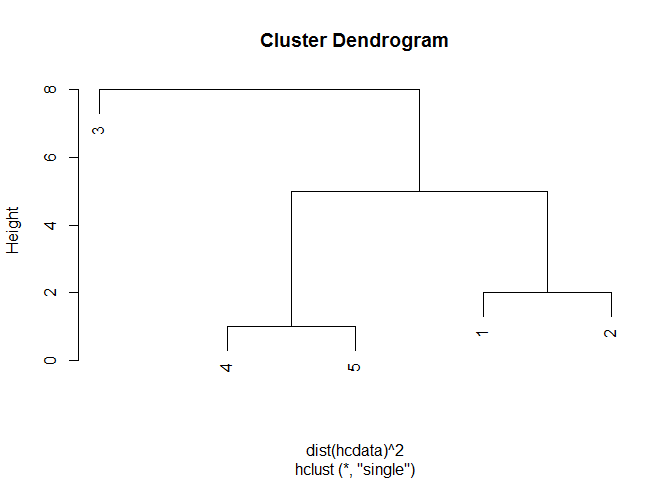
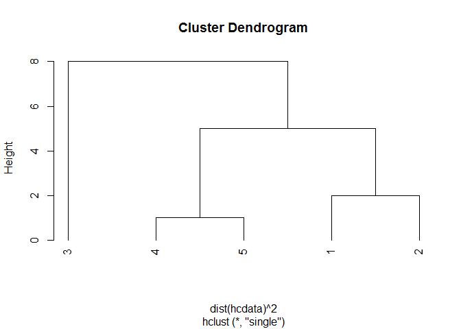
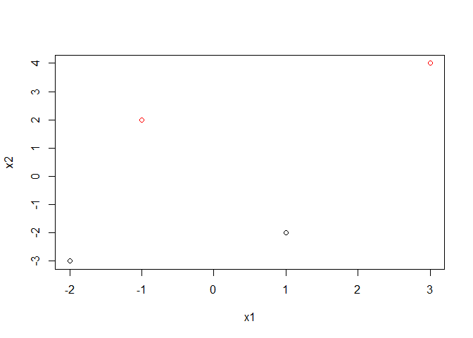
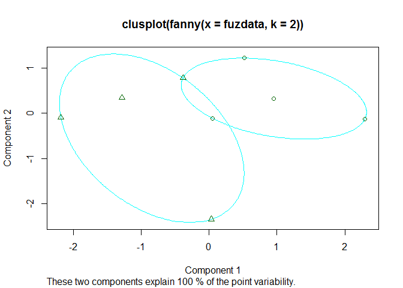
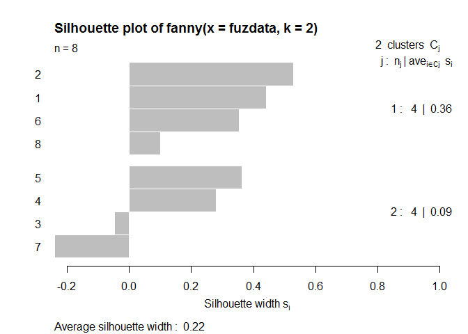
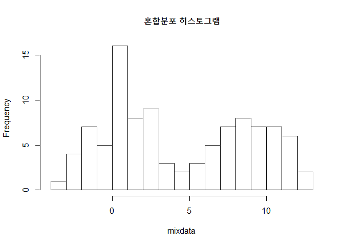

# ch.7
ksg  
2015년 10월 13일  


##계층적 군집모형

```r
#계층적 군집모형
x1<-c(1,2,4,4,5)
x2<-c(5,4,6,3,3)
hcdata<-data.frame(x1,x2)
```


```r
hcl<-hclust(dist(hcdata)^2, method='single')  
#최단연결법 single / 최장complete / 평균average/ / 중심centroid / 와드ward
hcl
```

```
## 
## Call:
## hclust(d = dist(hcdata)^2, method = "single")
## 
## Cluster method   : single 
## Distance         : euclidean 
## Number of objects: 5
```


```r
plot(hcl)
```

 

```r
plot(hcl, hang=-1)
```

 

## K-평균군집모형

```r
library(graphics)
x1<-c(3,-1,-2,1)
x2<-c(4,2,-3,-2)
kmdata<-data.frame(x1,x2)
```


```r
kcl<-kmeans(kmdata, 2)
plot(kmdata, col=kcl$cluster)
```

 


## 퍼지군집모형

```r
library('cluster')
```

```
## Warning: package 'cluster' was built under R version 3.2.2
```

```r
x1<-c(1,2,4,4,5,2,3,3)
x2<-c(5,4,6,3,3,3,3,4)
fuzdata<-data.frame(x1,x2)
```


```r
fcl<-fanny(fuzdata,2)
summary(fcl)
```

```
## Fuzzy Clustering object of class 'fanny' :                      
## m.ship.expon.        2
## objective     3.786843
## tolerance        1e-15
## iterations          40
## converged            1
## maxit              500
## n                    8
## Membership coefficients (in %, rounded):
##      [,1] [,2]
## [1,]   73   27
## [2,]   83   17
## [3,]   50   50
## [4,]   16   84
## [5,]   22   78
## [6,]   67   33
## [7,]   41   59
## [8,]   58   42
## Fuzzyness coefficients:
## dunn_coeff normalized 
##  0.6003531  0.2007062 
## Closest hard clustering:
## [1] 1 1 2 2 2 1 2 1
## 
## Silhouette plot information:
##   cluster neighbor   sil_width
## 2       1        2  0.52781960
## 1       1        2  0.44212061
## 6       1        2  0.35450083
## 8       1        2  0.09961361
## 5       2        1  0.36161128
## 4       2        1  0.27973346
## 3       2        1 -0.04829317
## 7       2        1 -0.24021916
## Average silhouette width per cluster:
## [1] 0.35601366 0.08820811
## Average silhouette width of total data set:
## [1] 0.2221109
## 
## 28 dissimilarities, summarized :
##    Min. 1st Qu.  Median    Mean 3rd Qu.    Max. 
##  1.0000  1.4142  2.2361  2.2438  3.0406  4.4721 
## Metric :  euclidean 
## Number of objects : 8
## 
## Available components:
##  [1] "membership"  "coeff"       "memb.exp"    "clustering"  "k.crisp"    
##  [6] "objective"   "convergence" "diss"        "call"        "silinfo"    
## [11] "data"
```

```r
plot(fcl)
```

  

## 혼합분포 군집모형

```r
n1<-rnorm(50,0,2)
n2<-rnorm(50,8,2)
mixdata<-c(n1,n2)
hist(mixdata, breaks=20, main='혼합분포 히스토그램')
```

 

###EM알고리즘 만들기 실습

```r
ntot=100  #전체 데이터수
theta1=-1 ; sigma1=2 #집단 1 초기값 : 평균 -1, 표준편차 2  
theta2=7 ; sigma2=2 #집단 2 초기값 : 평균 -7, 표준편차 2
iter=10 #알고리즘 반복횟수
theta1hat=0 #집단 1 평균 추정값 벡터
theta2hat=0 #집단 2 평균 추정값 벡터
```


```r
for(j in 1:iter) {
  p1<-0
  p2<-0
  bayes1<-0
  bayes2<-0
  thetaiter1<-0
  thetaiter2<-0
  
  for(i in 1:ntot) {
    p1[i] <- (1-pnorm(mixdata[i], theta1, sigma1))
    p2[i] <- (pnorm(mixdata[i], theta2, sigma2))
    bayes1[i] <- 0.5*p1[i]/(0.5*p1[i]+0.5*p2[i])
    bayes2[i] <- 0.5*p2[i]/(0.5*p1[i]+0.5*p2[i])
  }
  theta1hat[j] <- sum(theta1) / sum(bayes1)
  theta2hat[j] <- sum(theta2) / sum(bayes2)
  theta1 <- theta1hat[j]
  theta2 <- theta2hat[j]
}
result<-cbind(theta1hat, theta2hat)
```

```r
result
```

```
##           theta1hat    theta2hat
##  [1,] -2.061858e-02 1.359222e-01
##  [2,] -9.195442e-04 1.752085e-03
##  [3,] -4.169902e-05 2.247759e-05
##  [4,] -1.891109e-06 2.883592e-07
##  [5,] -8.576404e-08 3.699291e-09
##  [6,] -3.889500e-09 4.745732e-11
##  [7,] -1.763934e-10 6.088186e-13
##  [8,] -7.999646e-12 7.810388e-15
##  [9,] -3.627933e-13 1.001976e-16
## [10,] -1.645310e-14 1.285411e-18
```
