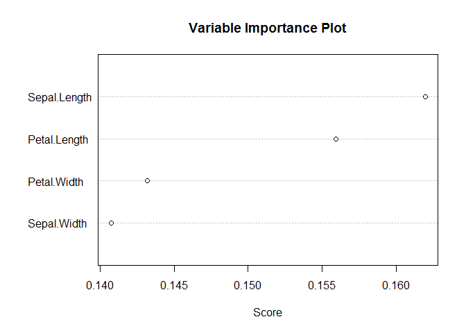

# ch6_practice
ksg  
2015년 10월 6일  

###인접이웃 분류모형

  - 데이터생성

```r
#install.packages("class")
library(class)
```

```
## Warning: package 'class' was built under R version 3.2.2
```

```r
age<-scale(rnorm(40, 30, 5))
income<-sample(c(200,300,400,500),size=40,replace=TRUE, prob=NULL)
purchase<-sample(c('구매', '비구매'),size=40,replace=TRUE, prob=NULL)
knndata<-data.frame(age,income,purchase)
```

  - 3-인접이웃분류 모형

```r
attach(knndata)
```

```
## The following objects are masked _by_ .GlobalEnv:
## 
##     age, income, purchase
```

```r
train<-knndata[1:20, c(1,2)]
test<-knndata[1:20, c(1,2)]
group<-purchase[1:20]
knnpred<-knn(train, test, group, k = 3, prob = TRUE)
knnpred
```

```
##  [1] 비구매 비구매 비구매 비구매 비구매 구매   구매   비구매 비구매 구매  
## [11] 비구매 비구매 비구매 비구매 비구매 비구매 구매   구매   비구매 비구매
## attr(,"prob")
##  [1] 0.6666667 0.6666667 0.6666667 1.0000000 0.6666667 0.6666667 1.0000000
##  [8] 0.6666667 0.6666667 0.6666667 0.6666667 1.0000000 1.0000000 1.0000000
## [15] 1.0000000 0.6666667 1.0000000 0.6666667 0.6666667 0.6666667
## Levels: 구매 비구매
```

```r
y=table(knnpred, group)
y
```

```
##         group
## knnpred  구매 비구매
##   구매      4      1
##   비구매    5     10
```

###신경망 모형
  - 데이터생성 

```r
#install.packages("nnet")
library(nnet)
```

```
## Warning: package 'nnet' was built under R version 3.2.2
```

```r
x1<-c(0,0,0,0,1,1,1,1)
x2<-c(0,0,1,1,0,0,1,1)
x3<-c(0,1,0,1,0,1,0,1)
y<-c(-1,-1,-1,+1,-1,+1,+1,+1)
nnetdata<-data.frame(x1,x2,x3,y)
```

  - 신경망 분류모형 

```r
attach(nnetdata)
```

```
## The following objects are masked _by_ .GlobalEnv:
## 
##     x1, x2, x3, y
```

```r
train = nnetdata[1:8,]
test = nnetdata[1:8,]
train.nnet = nnet(y~x1+x2+x3, data=train, size=2, rang=0.1, decay=5e-4, maxit=100)
```

```
## # weights:  11
## initial  value 10.188414 
## iter  10 value 7.634585
## iter  20 value 4.167511
## iter  30 value 4.132612
## iter  40 value 4.129922
## iter  50 value 4.129629
## iter  60 value 4.129601
## final  value 4.129601 
## converged
```
  
  - 예측모델의 관찰값을 0.1기준으로 분류 

```r
predict(train.nnet, test)
```

```
##           [,1]
## 1 6.212126e-05
## 2 2.056015e-03
## 3 2.073353e-03
## 4 9.454198e-01
## 5 2.065524e-03
## 6 9.453107e-01
## 7 9.455530e-01
## 8 9.892666e-01
```

```r
nnetpred = (predict(train.nnet, test) >= 0.01)
z = table(nnetpred, y)
z
```

```
##         y
## nnetpred -1 1
##    FALSE  4 0
##    TRUE   0 4
```

### 지지벡터기계 모형
  - 데이터

```r
x1<-c(25,34,26,28,21,31,36,20)
x2<-c(150,220,210,250,100,220,300,100)
y<-c(-1,+1,-1,+1,-1,+1,+1,-1)
svmdata<-data.frame(x1,x2,y)
```

  - 지지벡터기계 모형 생성

```r
#install.packages("e1071")
library(e1071)
```

```
## Warning: package 'e1071' was built under R version 3.2.2
```

```r
svmdata
```

```
##   x1  x2  y
## 1 25 150 -1
## 2 34 220  1
## 3 26 210 -1
## 4 28 250  1
## 5 21 100 -1
## 6 31 220  1
## 7 36 300  1
## 8 20 100 -1
```

```r
attach(svmdata)
```

```
## The following objects are masked _by_ .GlobalEnv:
## 
##     x1, x2, y
## 
## The following objects are masked from nnetdata:
## 
##     x1, x2, y
```

```r
train = svmdata[1:8,]
test = svmdata[1:8,]
train.svm = svm(y~x1+x2, type="C-classification", data=train)
train.svm
```

```
## 
## Call:
## svm(formula = y ~ x1 + x2, data = train, type = "C-classification")
## 
## 
## Parameters:
##    SVM-Type:  C-classification 
##  SVM-Kernel:  radial 
##        cost:  1 
##       gamma:  0.5 
## 
## Number of Support Vectors:  6
```

  - 집단분류

```r
svmpred = predict(train.svm, test)
svmpred
```

```
##  1  2  3  4  5  6  7  8 
## -1  1 -1  1 -1  1  1 -1 
## Levels: -1 1
```

```r
z = table(svmpred ,y)
z
```

```
##        y
## svmpred -1 1
##      -1  4 0
##      1   0 4
```

  - 시각화

```r
plot(x1,x2,pch=y)
abline(500,-10)
```

 

###아다부스팅 앙상블모형

  - 패키지설치
  - 데이터 : iris 데이터에서 3종의 꽃중 1종 없애고 2종만 남김

```r
#install.packages('ada')
library(ada)
```

```
## Warning: package 'ada' was built under R version 3.2.2
```

```
## Loading required package: rpart
```

```
## Warning: package 'rpart' was built under R version 3.2.2
```

```r
head(iris)
```

```
##   Sepal.Length Sepal.Width Petal.Length Petal.Width Species
## 1          5.1         3.5          1.4         0.2  setosa
## 2          4.9         3.0          1.4         0.2  setosa
## 3          4.7         3.2          1.3         0.2  setosa
## 4          4.6         3.1          1.5         0.2  setosa
## 5          5.0         3.6          1.4         0.2  setosa
## 6          5.4         3.9          1.7         0.4  setosa
```

```r
iris<-iris[iris$Species!="setosa",]
```

 - 100개 데이터중 60%는 훈련용 나머지40%는 시험용으로 사용

```r
n<-dim(iris)[1]
n
```

```
## [1] 100
```

```r
trind<-sample(1:n, floor(.6*n), FALSE) #training sample 
trind
```

```
##  [1]  81  28  62  84  95   9   1  32  36  98  43  11  96  66  45  74   7
## [18]   4  19  57  29  27  64  99  52  56  48  15  89  13  58  47  78  65
## [35]  75  49  61  93  39 100  83  33  90  41  31  92   3  55  42  38  17
## [52]   5  22  54  60  70  79  86  50  10
```

```r
teind<-setdiff(1:n,trind) #test sample 
teind
```

```
##  [1]  2  6  8 12 14 16 18 20 21 23 24 25 26 30 34 35 37 40 44 46 51 53 59
## [24] 63 67 68 69 71 72 73 76 77 80 82 85 87 88 91 94 97
```

```r
iris[,5]<-as.factor((levels(iris[,5])[2:3])[as.numeric(iris[,5])-1])
```

  - 60개 훈련용 데이터 trind를 이용해 아다부스팅 앙상블 모형생성
  - 시험용데이터에 적용

```r
gdis<-ada(Species ~ . , data=iris[trind,], iter=20, nu=1, type="discrete")
gdis
```

```
## Call:
## ada(Species ~ ., data = iris[trind, ], iter = 20, nu = 1, type = "discrete")
## 
## Loss: exponential Method: discrete   Iteration: 20 
## 
## Final Confusion Matrix for Data:
##             Final Prediction
## True value   versicolor virginica
##   versicolor         30         0
##   virginica           0        30
## 
## Train Error: 0 
## 
## Out-Of-Bag Error:  0.033  iteration= 6 
## 
## Additional Estimates of number of iterations:
## 
## train.err1 train.kap1 
##          8          8
```

  - 생성된 객체로 분류오류, 변주중요성, 중요변수 시각화

```r
gdis=addtest(gdis, iris[teind,-5], iris[teind,5])
plot(gdis, TRUE, TRUE) #분류오류에 대한 그리
```

 

```r
varplot(gdis) #변수의 중요성 그림
```

 

```r
pairs(gdis, iris[trind, -5], maxvar=2) #중요변수에 대한 산점도림
```

 
